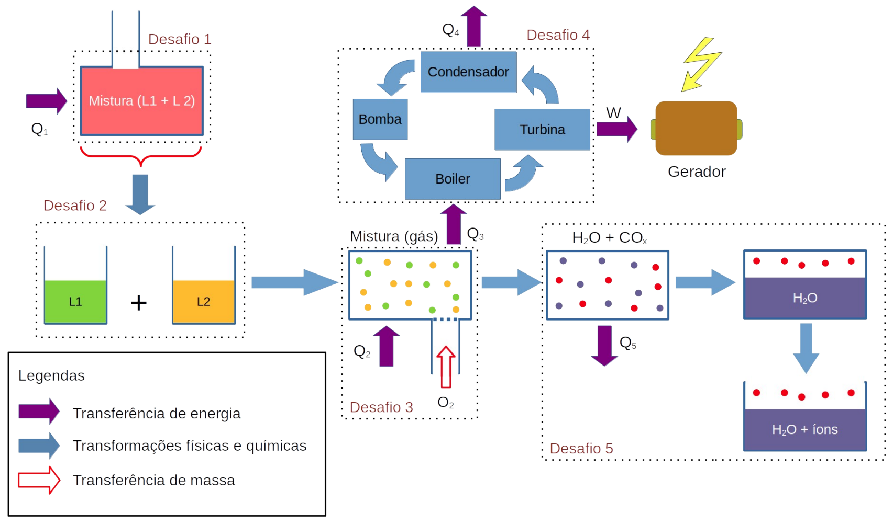

# Termodinâmica de uma usina elétrica a vapor

Trabalho proposto pelo Prof. Dr. Amauri Jardim de Paula para a disciplina de Termodinâmica Avançada do terceiro período do bacharelado em Ciência, Tecnologia e Inovação da Ilum, escola de ciência. O objetivo consiste em explorar diversas propriedades termodinâmicas, como entalpia, entropia e energia livre de Gibbs, a fim de calcular a reação de combustão de uma mistura binária que libera energia no processo. Essa energia é necessária para modelar um ciclo de Rankine, no qual foi feita a comparação entre os tipos simples, com reaquecimento e regenerativo, identificando este último com maior potencial para rendimento energético.

A imagem a seguir apresenta as etapas do ciclo de Rankine e neste repositório encontram-se os desafios de 1 a 4 desenvolvidos.

